# SafeBeauty Backend Architecture Overview

## Table of Contents
1. [Architecture Diagram](#architecture-diagram)
2. [Database Models](#database-models)
3. [Services Layer](#services-layer)
4. [DTOs (Data Transfer Objects)](#dtos)
5. [Controllers & API Endpoints](#controllers--api-endpoints)
6. [Class Relationships & Dependencies](#class-relationships--dependencies)
7. [Key Design Patterns](#key-design-patterns)

---

## Architecture Diagram

```mermaid
classDiagram
    %% ============ MODELS (Database Entities) ============
    class Ingredient {
        int Id
        string InciName
        string NormalizedInciName
        string CasNumber
        string Function
        SafetyRating SafetyRating
        string Source
        --
        ICollection~IngredientCategoryMapping~ CategoryMappings
        ICollection~IngredientSynonym~ Synonyms
        ICollection~AnnexRestriction~ AnnexRestrictions
    }

    class IngredientCategory {
        int Id
        string Name
        string Description
        --
        ICollection~IngredientCategoryMapping~ IngredientMappings
        ICollection~ConditionRule~ ConditionRules
    }

    class IngredientCategoryMapping {
        int IngredientId (PK)
        int CategoryId (PK)
        string MappingType
        string Source
        string Notes
        --
        Ingredient Ingredient
        IngredientCategory Category
    }

    class IngredientSynonym {
        int Id
        int IngredientId
        string SynonymName
        --
        Ingredient Ingredient
    }

    class AnnexRestriction {
        int Id
        int IngredientId
        AnnexType AnnexType
        string MaxConcentration
        string ProductType
        string Detail
        --
        Ingredient Ingredient
    }

    class ConditionRule {
        int Id
        int CategoryId
        string EvidenceSource
        string Notes
        Condition Condition
        FlagType FlagType
        --
        IngredientCategory Category
    }

    class UserProfile {
        int Id
        string UserId
        string SkinType
        string HairCondition
        string AgeGroup
        string Gender
        string ConditionsJson
        --
        IdentityUser User
    }

    class ScanHistory {
        int Id
        string UserId
        string Barcode
        string ProductName
        string IngredientJson
        DateTime ScannedAt
        --
        IdentityUser User
    }

    %% ============ ENUMS ============
    class SafetyRating {
        <<enumeration>>
        Green
        Amber
        Red
        Grey
        PermittedWithConditions
    }

    class Condition {
        <<enumeration>>
        Acne
        Rosacea
        Psoriasis
        Alopecia
        AtopicDermatitis
        SeborrhoeicDermatitis
        KeratosisPilaris
        ActinicKeratoses
    }

    class FlagType {
        <<enumeration>>
        Avoid
        Caution
        Beneficial
    }

    class AnnexType {
        <<enumeration>>
        II
        III
        IV
        V
        VI
    }

    %% ============ SERVICES ============
    class IngredientAnalysisService {
        SafeBeautyDbContext _context
        HuggingFaceService _huggingFace
        AiSummaryService _aiSummary
        --
        Task~AnalyseResponse~ AnalyseAsync(ingredients, conditions, ageGroup, gender)
    }

    class AiSummaryService {
        HttpClient _httpClient
        string _apiKey
        ILogger~AiSummaryService~ _logger
        --
        Task~string~ SummariseAsync(results, conditions, ageGroup, gender)
        string BuildFallbackSummary(results)
        Task~string~ ViolatesSafetyBoundary(summary)
    }

    class HuggingFaceService {
        HttpClient _httpClient
        string _apiKey
        ILogger~HuggingFaceService~ _logger
        --
        Task~AiIngredientResultDto~ ClassifyAsync(ingredientName)
    }

    class UvFilterClassifier {
        <<static>>
        string AnnexSource
        string CurrentMappingType
        --
        +bool IsConfirmedAnnexViMapping(mapping)
        +string Classify(inciName)
    }

    class IngredientNormalizer {
        <<static>>
        +string Normalize(name)
        +List~string~ Segment(text, knownNames)
    }

    class IngredientListParser {
        <<static>>
        +List~string~ Parse(ingredients)
        +bool LooksLikeUnseparatedList(text)
        +List~string~ SegmentByKnownNames(text, knownNames)
    }

    class BarcodeValidator {
        <<static>>
        +bool TryValidate(barcode, error)
        -bool HasValidGtinCheckDigit(barcode)
        -bool IsValidUpcE(barcode)
    }

    class IngredientDeduplicationService {
        SafeBeautyDbContext _context
        ILogger~IngredientDeduplicationService~ _logger
        --
        Task RunAsync()
        -Task FillNormalizedNamesAsync()
        -Task MergeDuplicatesAsync()
    }

    class EmailService {
        EmailSettings _emailSettings
        --
        void SendEmail(toEmail, subject, body)
    }

    %% ============ CONTROLLERS ============
    class ProductsController {
        IngredientAnalysisService _analysisService
        HttpClient _httpClient
        --
        Task~ActionResult~ProductAnalyseResponse~~ GetByBarcode(barcode, request)
        -Task~ActionResult~ProductAnalyseResponse~~ BuildProductResponse(...)
        -List~string~ ExtractIngredientsFromText(product)
    }

    class IngredientsController {
        SafeBeautyDbContext _context
        IngredientAnalysisService _analysisService
        --
        Task~ActionResult~IEnumerable~IngredientDto~~~ GetIngredients(search)
        Task~ActionResult~IngredientDto~~ GetIngredient(id)
        Task~ActionResult~AnalyseResponse~~ Analyse(request)
    }

    class UserProfileController {
        SafeBeautyDbContext _context
        --
        Task~IActionResult~ Get()
        Task~IActionResult~ Save(request)
        -string CurrentUserId
    }

    class ScanHistoryController {
        SafeBeautyDbContext _context
        --
        Task~IActionResult~ GetAll()
        Task~IActionResult~ Create(request)
        Task~IActionResult~ Update(id, request)
        Task~IActionResult~ Delete(id)
        Task~IActionResult~ DeleteAll()
        -Task~ScanHistory~ FindOwnedAsync(id)
    }

    class AccountController {
        UserManager~IdentityUser~ _userManager
        SignInManager~IdentityUser~ _signInManager
        EmailService _emailService
        IConfiguration _configuration
        --
        Task~IActionResult~ Register(model)
        Task~IActionResult~ VerifyEmail(userId, token)
        Task~IActionResult~ Login(model)
        Task~IActionResult~ Logout()
        -string GenerateJwtToken(user, roles)
    }

    %% ============ DTOs ============
    class AnalyseRequest {
        List~string~ Ingredients
        List~string~ UserConditions
        string AgeGroup
        string Gender
    }

    class AnalyseResponse {
        List~IngredientResultDto~ Results
        List~AiIngredientResultDto~ UnknownIngredients
        string AiSummary
    }

    class IngredientResultDto {
        string InciName
        string SafetyRating
        string Category
        string Function
        bool IsUvFilter
        string UvFilterType
        List~ConditionFlagDto~ ConditionFlags
    }

    class AiIngredientResultDto {
        string Name
        string AiLabel
        double Confidence
    }

    class ConditionFlagDto {
        string Condition
        string FlagType
        string Notes
        string EvidenceSource
    }

    class IngredientDto {
        int Id
        string InciName
        string CasNumber
        string Function
        string SafetyRating
        string Source
        List~IngredientCategoryDto~ Categories
    }

    class IngredientCategoryDto {
        int Id
        string Name
        string Description
    }

    class UserProfileDto {
        string SkinType
        string HairCondition
        string AgeGroup
        string Gender
        List~string~ Conditions
    }

    class ScanHistoryDto {
        string Id
        DateTime CreatedAt
        JsonElement Results
        JsonElement AnalysisContext
    }

    class BarcodeAnalyseRequest {
        List~string~ UserConditions
        string AgeGroup
        string Gender
    }

    class ScanHistorySaveRequest {
        JsonElement Results
        JsonElement AnalysisContext
    }

    class AuthModel {
        string Email
        string Password
    }

    %% ============ DATABASE CONTEXT ============
    class SafeBeautyDbContext {
        <<DbContext>>
        DbSet~Ingredient~ Ingredients
        DbSet~IngredientCategory~ IngredientCategories
        DbSet~IngredientCategoryMapping~ IngredientCategoryMappings
        DbSet~IngredientSynonym~ IngredientSynonyms
        DbSet~AnnexRestriction~ AnnexRestrictions
        DbSet~ConditionRule~ ConditionRules
        DbSet~ScanHistory~ ScanHistories
        DbSet~UserProfile~ UserProfiles
        --
        -void OnModelCreating(ModelBuilder modelBuilder)
    }

    class EmailSettings {
        string SmtpServer
        int SmtpPort
        string SmtpUsername
        string SmtpPassword
    }

    %% ============ RELATIONSHIPS ============
    
    %% Model relationships
    Ingredient "1" --> "many" IngredientCategoryMapping
    Ingredient "1" --> "many" IngredientSynonym
    Ingredient "1" --> "many" AnnexRestriction
    IngredientCategory "1" --> "many" IngredientCategoryMapping
    IngredientCategory "1" --> "many" ConditionRule
    IngredientCategoryMapping "many" --> "1" Ingredient
    IngredientCategoryMapping "many" --> "1" IngredientCategory
    IngredientSynonym "many" --> "1" Ingredient
    AnnexRestriction "many" --> "1" Ingredient
    ConditionRule "many" --> "1" IngredientCategory

    %% Enums usage
    Ingredient --> SafetyRating
    ConditionRule --> Condition
    ConditionRule --> FlagType
    AnnexRestriction --> AnnexType

    %% Service dependencies
    IngredientAnalysisService --> SafeBeautyDbContext
    IngredientAnalysisService --> HuggingFaceService
    IngredientAnalysisService --> AiSummaryService
    IngredientAnalysisService --> IngredientListParser
    IngredientAnalysisService --> IngredientNormalizer
    IngredientAnalysisService --> UvFilterClassifier
    AiSummaryService --> AnalyseResponse
    HuggingFaceService --> AiIngredientResultDto
    IngredientDeduplicationService --> SafeBeautyDbContext
    EmailService --> EmailSettings

    %% Controller dependencies
    ProductsController --> IngredientAnalysisService
    ProductsController --> BarcodeValidator
    IngredientsController --> SafeBeautyDbContext
    IngredientsController --> IngredientAnalysisService
    UserProfileController --> SafeBeautyDbContext
    ScanHistoryController --> SafeBeautyDbContext
    AccountController --> EmailService

    %% DTO relationships
    AnalyseResponse --> IngredientResultDto
    AnalyseResponse --> AiIngredientResultDto
    IngredientResultDto --> ConditionFlagDto
    IngredientDto --> IngredientCategoryDto
    ScanHistoryController --> ScanHistoryDto

    %% Database relationships
    SafeBeautyDbContext --> Ingredient
    SafeBeautyDbContext --> IngredientCategory
    SafeBeautyDbContext --> IngredientCategoryMapping
    SafeBeautyDbContext --> IngredientSynonym
    SafeBeautyDbContext --> AnnexRestriction
    SafeBeautyDbContext --> ConditionRule
    SafeBeautyDbContext --> UserProfile
    SafeBeautyDbContext --> ScanHistory
```



---

## Database Models

### Core Entity Models

#### **Ingredient**
Main entity representing a cosmetic ingredient.

| Property | Type | Description |
|----------|------|-------------|
| `Id` | `int` | Primary Key |
| `InciName` | `string` | INCI (International Nomenclature of Cosmetic Ingredients) name |
| `NormalizedInciName` | `string` | Normalized (trimmed + uppercase) name for consistent lookup |
| `CasNumber` | `string?` | CAS (Chemical Abstracts Service) number |
| `Function` | `string` | Ingredient's cosmetic function |
| `SafetyRating` | `SafetyRating` | Enum: Green, Amber, Red, Grey, PermittedWithConditions |
| `Source` | `string` | Data source (e.g., COSING database) |

**Relationships:**
- **One-to-Many** with `IngredientCategoryMapping` (ingredient can belong to multiple categories)
- **One-to-Many** with `IngredientSynonym` (ingredient can have multiple synonym names)
- **One-to-Many** with `AnnexRestriction` (ingredient can have regulatory restrictions)

---

#### **IngredientCategory**
Categories for grouping ingredients (e.g., "UV Filter", "Preservative").

| Property | Type | Description |
|----------|------|-------------|
| `Id` | `int` | Primary Key |
| `Name` | `string` | Category name |
| `Description` | `string?` | Optional category description |

**Relationships:**
- **One-to-Many** with `IngredientCategoryMapping` (category maps to many ingredients)
- **One-to-Many** with `ConditionRule` (category can have condition-specific rules)

---

#### **IngredientCategoryMapping**
Join table connecting ingredients to categories with metadata.

| Property | Type | Description |
|----------|------|-------------|
| `IngredientId` | `int` | Foreign Key (Composite PK) |
| `CategoryId` | `int` | Foreign Key (Composite PK) |
| `MappingType` | `string` | Type of mapping (e.g., "RegulatoryAnnexNormalizedV3") |
| `Source` | `string` | Data source for this mapping |
| `Notes` | `string` | Additional notes |

**Relationships:**
- **Many-to-One** with `Ingredient`
- **Many-to-One** with `IngredientCategory`

---

#### **IngredientSynonym**
Alternative names for ingredients (e.g., "Glycerol" as synonym for "Glycerin").

| Property | Type | Description |
|----------|------|-------------|
| `Id` | `int` | Primary Key |
| `IngredientId` | `int` | Foreign Key |
| `SynonymName` | `string` | Synonym name |

**Relationships:**
- **Many-to-One** with `Ingredient`

---

#### **AnnexRestriction**
EU cosmetic regulation restrictions (Annex II-VI) on ingredients.

| Property | Type | Description |
|----------|------|-------------|
| `Id` | `int` | Primary Key |
| `IngredientId` | `int` | Foreign Key |
| `AnnexType` | `AnnexType` | Enum: II, III, IV, V, VI |
| `MaxConcentration` | `string?` | Maximum allowed concentration |
| `ProductType` | `string?` | Product type restriction (e.g., "rinse-off products only") |
| `Detail` | `string` | Detailed restriction description |

**Relationships:**
- **Many-to-One** with `Ingredient`

---

#### **ConditionRule**
Rules mapping ingredient categories to skin conditions with recommendation flags.

| Property | Type | Description |
|----------|------|-------------|
| `Id` | `int` | Primary Key |
| `CategoryId` | `int` | Foreign Key |
| `Condition` | `Condition` | Enum: Acne, Rosacea, Psoriasis, Alopecia, AtopicDermatitis, etc. |
| `FlagType` | `FlagType` | Enum: Avoid, Caution, Beneficial |
| `EvidenceSource` | `string` | Research/data source for this rule |
| `Notes` | `string` | Notes about the condition |

**Relationships:**
- **Many-to-One** with `IngredientCategory`

---

#### **UserProfile**
User preferences and skin conditions.

| Property | Type | Description |
|----------|------|-------------|
| `Id` | `int` | Primary Key |
| `UserId` | `string` | Foreign Key to ASP.NET Identity User |
| `SkinType` | `string?` | User's skin type |
| `HairCondition` | `string?` | User's hair condition |
| `AgeGroup` | `string?` | User's age group |
| `Gender` | `string?` | User's gender |
| `ConditionsJson` | `string` | JSON-serialized list of skin conditions |

**Relationships:**
- **One-to-One** with `IdentityUser` (ASP.NET Core Identity)

---

#### **ScanHistory**
History of product scans and manual ingredient analyses.

| Property | Type | Description |
|----------|------|-------------|
| `Id` | `int` | Primary Key |
| `UserId` | `string` | Foreign Key to ASP.NET Identity User |
| `Barcode` | `string?` | Product barcode |
| `ProductName` | `string?` | Product name |
| `IngredientJson` | `string` | JSON-serialized analysis results |
| `ScannedAt` | `DateTime` | Timestamp of analysis |

**Relationships:**
- **Many-to-One** with `IdentityUser` (ASP.NET Core Identity)

---

## Services Layer

### **IngredientAnalysisService**
**Primary Business Logic** - Analyzes product ingredients and provides personalized safety information.

**Key Responsibilities:**
- Parse ingredient lists (handle various formats: comma-separated, bullet-point, unseparated)
- Normalize ingredient names for database lookup
- Match ingredients against known database and synonyms
- Classify unknown ingredients using AI (Hugging Face)
- Generate condition-specific recommendations
- Integrate AI summaries

**Key Methods:**

```csharp
public async Task<AnalyseResponse> AnalyseAsync(
    List<string> ingredients,
    List<string>? userConditions = null,
    string? ageGroup = null,
    string? gender = null)
```

**Dependencies:**
- `SafeBeautyDbContext` - Database access
- `HuggingFaceService` - AI classification for unknown ingredients
- `AiSummaryService` - AI-generated product summaries
- `IngredientListParser` (static) - Parsing ingredient lists
- `IngredientNormalizer` (static) - Normalizing ingredient names
- `UvFilterClassifier` (static) - Classifying UV filters

**Data Flow:**
1. Parse ingredient list (handle various separators)
2. Normalize ingredient names
3. Query database for known ingredients with their categories
4. Look up synonyms for unknown ingredients
5. Classify remaining unknowns via Hugging Face AI
6. Match categories to user's skin conditions
7. Generate condition flags (Avoid/Caution/Beneficial)
8. Generate AI summary

---

### **HuggingFaceService**
**AI Classification** - Classifies unknown ingredients using zero-shot classification model.

**Key Responsibilities:**
- Send ingredient names to Hugging Face Inference API
- Classify against predefined labels: "safe cosmetic ingredient", "skin irritant", "potentially harmful", "allergen"
- Return confidence scores

**Key Methods:**

```csharp
public async Task<AiIngredientResultDto> ClassifyAsync(string ingredientName)
```

**Configuration:**
- Requires `HuggingFace:ApiKey` in appsettings.json
- Uses model: `facebook/bart-large-mnli`
- Labels: Safe, Irritant, Harmful, Allergen

**Error Handling:** Returns "Unknown" result if API fails or timeout occurs (graceful degradation)

---

### **AiSummaryService**
**Text Generation** - Generates personalized product summaries using LLM.

**Key Responsibilities:**
- Build system and user prompts for LLM
- Send requests to Hugging Face Chat Completion API
- Validate summary safety boundaries (no medical claims, treatment promises)
- Ensure regulatory compliance
- Provide fallback text if AI unavailable

**Key Methods:**

```csharp
public async Task<string> SummariseAsync(
    AnalyseResponse results,
    IReadOnlyCollection<string> userConditions,
    string? ageGroup = null,
    string? gender = null)
```

**Configuration:**
- Requires `HuggingFace:LlmApiKey`
- Model: `meta-llama/Llama-3.1-8B-Instruct`
- Temperature: 0.3 (low for conservative wording)
- Max tokens: 280

**Safety Checks:**
- Blocks phrases like "suitable for", "recommended for", "treats", "heals", etc.
- Prevents contradictions with profile-specific flags
- Ensures regulatory warning prefix when needed

---

### **UvFilterClassifier**
**Static Utility** - Classifies UV filters into types.

**Classification Types:**
- Mineral / inorganic (Titanium Dioxide, Zinc Oxide)
- Organic particulate
- Organic

**Key Methods:**

```csharp
public static bool IsConfirmedAnnexViMapping(IngredientCategoryMapping mapping)
public static string Classify(string inciName)
```

---

### **IngredientListParser**
**Static Utility** - Parses various ingredient list formats.

**Supported Formats:**
- Comma-separated: "Aqua, Glycerin, Niacinamide"
- Bullet-separated: "• Aqua\n• Glycerin\n• Niacinamide"
- Unseparated list: "AquaGlycerinNiacinamide" (uses known names to infer boundaries)

**Key Methods:**

```csharp
public static List<string> Parse(List<string> ingredients)
public static bool LooksLikeUnseparatedList(string text)
public static List<string> SegmentByKnownNames(string text, List<string> knownNames)
```

---

### **IngredientNormalizer**
**Static Utility** - Normalizes ingredient names for consistent matching.

**Normalization:**
- Trim whitespace
- Convert to UPPERCASE
- Remove trailing punctuation

```csharp
public static string Normalize(string name)
```

---

### **BarcodeValidator**
**Static Utility** - Validates product barcodes (UPC/EAN/GTIN).

**Supported Formats:**
- EAN-13 (13 digits)
- UPC-A (12 digits)
- UPC-E (8 digits)

**Validation:**
- Checks digit length
- Validates check digit (GTIN algorithm)
- Supports UPC-E expansion

```csharp
public static bool TryValidate(string? barcode, out string error)
```

---

### **IngredientDeduplicationService**
**Data Cleanup** - One-off service to deduplicate ingredients and normalize names.

**Two-Phase Process:**
1. **Fill Normalized Names** - Compute and store normalized names for existing rows
2. **Merge Duplicates** - Merge case-insensitive duplicates (e.g., "RETINOL" + "Retinol")

**Merge Strategy:**
- Survivor selected by data quality (most metadata), then by oldest ID
- Duplicate's child records moved to survivor
- Strictest safety rating maintained

```csharp
public async Task RunAsync()
```

---

### **EmailService**
**Communication** - Sends emails via SMTP.

**Uses:**
- Account registration verification
- Password reset (future)

**Configuration:**
- Requires `EmailSettings` (SmtpServer, Port, Username, Password)
- Uses MailKit for SMTP

```csharp
public void SendEmail(string toEmail, string subject, string body)
```

---

## DTOs

### Request DTOs

#### **AnalyseRequest**
Used by `POST /api/Ingredients/analyse` endpoint.

```csharp
public class AnalyseRequest
{
    public List<string> Ingredients { get; set; }
    public List<string> UserConditions { get; set; }
    public string? AgeGroup { get; set; }
    public string? Gender { get; set; }
}
```

#### **BarcodeAnalyseRequest**
Used by `POST /api/Products/barcode/{barcode}` endpoint.

```csharp
public class BarcodeAnalyseRequest
{
    public List<string> UserConditions { get; set; }
    public string? AgeGroup { get; set; }
    public string? Gender { get; set; }
}
```

#### **AuthModel**
Used by account registration and login.

```csharp
public class AuthModel
{
    public string Email { get; set; }
    public string Password { get; set; }
}
```

#### **UserProfileDto**
Used by user profile management endpoints.

```csharp
public class UserProfileDto
{
    public string? SkinType { get; set; }
    public string? HairCondition { get; set; }
    public string? AgeGroup { get; set; }
    public string? Gender { get; set; }
    public List<string> Conditions { get; set; }
}
```

#### **ScanHistorySaveRequest**
Used by scan history creation/update endpoints.

```csharp
public class ScanHistorySaveRequest
{
    public JsonElement Results { get; set; }
    public JsonElement AnalysisContext { get; set; }
}
```

---

### Response DTOs

#### **AnalyseResponse**
Main response from ingredient analysis.

```csharp
public class AnalyseResponse
{
    public List<IngredientResultDto> Results { get; set; }
    public List<AiIngredientResultDto> UnknownIngredients { get; set; }
    public string AiSummary { get; set; }
}
```

#### **IngredientResultDto**
Individual ingredient analysis result.

```csharp
public class IngredientResultDto
{
    public string InciName { get; set; }
    public string SafetyRating { get; set; }
    public string Category { get; set; }
    public string Function { get; set; }
    public bool IsUvFilter { get; set; }
    public string UvFilterType { get; set; }
    public List<ConditionFlagDto> ConditionFlags { get; set; }
}
```

#### **ConditionFlagDto**
Condition-specific recommendation for an ingredient category.

```csharp
public class ConditionFlagDto
{
    public string Condition { get; set; }
    public string FlagType { get; set; }           // "Avoid", "Caution", "Beneficial"
    public string Notes { get; set; }
    public string EvidenceSource { get; set; }
}
```

#### **AiIngredientResultDto**
AI classification for unknown ingredients.

```csharp
public class AiIngredientResultDto
{
    public string Name { get; set; }
    public string AiLabel { get; set; }            // "safe cosmetic ingredient", "skin irritant", etc.
    public double Confidence { get; set; }         // 0.0 - 1.0
}
```

#### **IngredientDto**
Ingredient data returned by ingredient lookup endpoints.

```csharp
public class IngredientDto
{
    public int Id { get; set; }
    public string InciName { get; set; }
    public string? CasNumber { get; set; }
    public string Function { get; set; }
    public string SafetyRating { get; set; }
    public string Source { get; set; }
    public List<IngredientCategoryDto> Categories { get; set; }
}

public class IngredientCategoryDto
{
    public int Id { get; set; }
    public string Name { get; set; }
    public string? Description { get; set; }
}
```

#### **ScanHistoryDto**
Scan history entry response.

```csharp
public class ScanHistoryDto
{
    public string Id { get; set; }
    public DateTime CreatedAt { get; set; }
    public JsonElement Results { get; set; }
    public JsonElement AnalysisContext { get; set; }
}
```

---

## Controllers & API Endpoints

### **ProductsController**
**Base Route:** `api/products`

**Endpoints:**

| Method | Route | Purpose | Authentication |
|--------|-------|---------|-----------------|
| POST | `/barcode/{barcode}` | Analyze product by barcode | Not required |

**Key Methods:**

```csharp
public async Task<ActionResult<ProductAnalyseResponse>> GetByBarcode(
    string barcode,
    [FromBody] BarcodeAnalyseRequest? request)
```

**Workflow:**
1. Validate barcode format using `BarcodeValidator`
2. Fetch product data from Open Beauty Facts API
3. Extract ingredient list (structured or raw text)
4. Analyze ingredients using `IngredientAnalysisService`
5. Return results with AI summary

**Error Responses:**
- 400: Invalid barcode format
- 404: Product not found
- 502: Open Beauty Facts API error
- 503: Open Beauty Facts timeout

---

### **IngredientsController**
**Base Route:** `api/ingredients`

**Endpoints:**

| Method | Route | Purpose | Authentication |
|--------|-------|---------|-----------------|
| GET | `/` | Search/list ingredients | Not required |
| GET | `/{id}` | Get ingredient by ID | Not required |
| POST | `/analyse` | Analyze ingredient list | Not required |

**Key Methods:**

```csharp
public async Task<ActionResult<IEnumerable<IngredientDto>>> GetIngredients(
    [FromQuery] string? search)

public async Task<ActionResult<IngredientDto>> GetIngredient(int id)

public async Task<ActionResult<AnalyseResponse>> Analyse(
    [FromBody] AnalyseRequest request)
```

**Search Features:**
- Full-text search by normalized INCI name
- Returns up to 50 results
- Includes categories for each ingredient

---

### **UserProfileController**
**Base Route:** `api/userprofile`
**Authentication:** Required (Authorization header)

**Endpoints:**

| Method | Route | Purpose |
|--------|-------|---------|
| GET | `/` | Get user's profile |
| PUT | `/` | Save/update user's profile |

**Key Methods:**

```csharp
[Authorize]
public async Task<IActionResult> Get()

[Authorize]
public async Task<IActionResult> Save(UserProfileDto request)
```

**Data Stored:**
- Skin type, hair condition, age group, gender
- Skin conditions (persisted as JSON)
- Used to personalize ingredient recommendations

---

### **ScanHistoryController**
**Base Route:** `api/scanhistory`
**Authentication:** Required (Authorization header)

**Endpoints:**

| Method | Route | Purpose |
|--------|-------|---------|
| GET | `/` | Get user's scan history (20 most recent) |
| POST | `/` | Create new scan history entry |
| PUT | `/{id}` | Update scan history entry |
| DELETE | `/{id}` | Delete specific scan history entry |
| DELETE | `/` | Delete all user's scan history |

**Key Methods:**

```csharp
[Authorize]
public async Task<IActionResult> GetAll()

[Authorize]
public async Task<IActionResult> Create(ScanHistorySaveRequest request)

[Authorize]
public async Task<IActionResult> Update(int id, ScanHistorySaveRequest request)

[Authorize]
public async Task<IActionResult> Delete(int id)

[Authorize]
public async Task<IActionResult> DeleteAll()
```

**Ownership Check:**
- All operations verified to ensure user can only access their own data

---

### **AccountController**
**Base Route:** `api/account`

**Endpoints:**

| Method | Route | Purpose | Authentication |
|--------|-------|---------|-----------------|
| POST | `/register` | Register new user | Not required |
| GET | `/verify-email` | Verify email token | Not required |
| POST | `/login` | Login and get JWT token | Not required |
| POST | `/logout` | Logout | Required |

**Key Methods:**

```csharp
public async Task<IActionResult> Register(AuthModel model)

public async Task<IActionResult> VerifyEmail(string userId, string token)

public async Task<IActionResult> Login(AuthModel model)

public async Task<IActionResult> Logout()

private string GenerateJwtToken(IdentityUser user, IList<string> roles)
```

**Authentication:**
- Uses ASP.NET Core Identity for user management
- JWT tokens for API authentication
- Email verification via token link

**JWT Claims:**
- `sub` (email)
- `jti` (JWT ID)
- `NameIdentifier` (User ID)
- `Role` (user roles, if any)

---

## Class Relationships & Dependencies

### Dependency Injection Pattern
All services use **Constructor Injection** via ASP.NET Core's built-in DI container:

```csharp
public IngredientAnalysisService(
    SafeBeautyDbContext context,
    HuggingFaceService huggingFace,
    AiSummaryService aiSummary)
{
    _context = context;
    _huggingFace = huggingFace;
    _aiSummary = aiSummary;
}
```

### Service Composition Hierarchy

```
Controllers
    ↓ (depends on)
ProductsController → IngredientAnalysisService → HuggingFaceService
                  ↓                           ↓
              BarcodeValidator           AiSummaryService
                                         ↓
                                    IngredientListParser
                                    IngredientNormalizer
                                    UvFilterClassifier
                                         ↓
                                    SafeBeautyDbContext
```

### Entity Relationships Summary

```
Ingredient (core entity)
├── 1:N → IngredientCategoryMapping → N:1 ← IngredientCategory
│                                            ├── 1:N → ConditionRule
│                                            └── includes: Condition, FlagType
├── 1:N → IngredientSynonym
├── 1:N → AnnexRestriction (includes: AnnexType)
└── Has SafetyRating enum

UserProfile
└── 1:1 ← IdentityUser (stores: SkinType, HairCondition, Conditions JSON)

ScanHistory
├── N:1 ← IdentityUser
└── Stores IngredientJson (serialized analysis results)
```

---

## Key Design Patterns

### 1. **Dependency Injection**
- All services injected via constructor
- Enables testing, loose coupling
- Configured in `Program.cs`

### 2. **Repository Pattern** (implicit)
- Database context accessed through `SafeBeautyDbContext`
- LINQ queries encapsulate data access logic
- Controllers and services interact through context

### 3. **DTO Pattern**
- Separate DTOs from database models
- Controllers return DTOs, not raw entities
- Prevents exposing internal structure
- Example: `Ingredient` (model) → `IngredientDto` (DTO)

### 4. **Static Utility Classes**
- `IngredientNormalizer`, `IngredientListParser`, `UvFilterClassifier`, `BarcodeValidator`
- Reusable, stateless logic
- No DI needed; called directly

### 5. **Graceful Degradation**
- AI services (Hugging Face, LLM) have fallbacks
- If external APIs fail, system returns "Unknown" or fallback text
- Application continues to function

### 6. **Normalization Strategy**
- Ingredients normalized before database lookup
- Handles case-insensitivity, punctuation, aliases
- Ensures consistent matching across various input formats

### 7. **Composite DTO**
- `AnalyseResponse` combines multiple DTO types:
  - Known ingredients: `IngredientResultDto` (with `ConditionFlagDto`)
  - Unknown ingredients: `AiIngredientResultDto`
  - Summary: AI-generated text

### 8. **Ownership Verification**
- Controllers verify user owns data before returning/modifying
- Extract user ID from JWT claims
- Example: `CurrentUserId` property in `ScanHistoryController`

### 9. **Enum-Based Safety Ratings**
- `SafetyRating`: Green, Amber, Red, Grey, PermittedWithConditions
- `Condition`: Skin conditions (Acne, Rosacea, etc.)
- `FlagType`: Avoid, Caution, Beneficial
- Type-safe instead of magic strings

### 10. **JSON Serialization for Complex Data**
- `UserProfile.ConditionsJson`: JSON-serialized condition list
- `ScanHistory.IngredientJson`: Complete analysis result stored as JSON
- Allows flexible storage without changing schema

---

## Data Flow Examples

### Example 1: Analyze Ingredients (Manual)
```
User sends AnalyseRequest
    ↓
IngredientsController.Analyse()
    ↓
IngredientAnalysisService.AnalyseAsync()
    ├─ IngredientListParser.Parse()
    ├─ IngredientNormalizer.Normalize()
    ├─ Query Ingredients + Categories + ConditionRules
    ├─ Query IngredientSynonyms (for unknowns)
    ├─ HuggingFaceService.ClassifyAsync() (for remaining unknowns)
    ├─ UvFilterClassifier.Classify() (for UV filters)
    ├─ AiSummaryService.SummariseAsync()
    └─ Return AnalyseResponse
        ├─ Known ingredients with condition flags
        ├─ Unknown ingredients with AI confidence
        └─ AI-generated summary
```

### Example 2: Analyze Product by Barcode
```
User sends barcode "5060342000035"
    ↓
ProductsController.GetByBarcode()
    ├─ BarcodeValidator.TryValidate()
    ├─ Open Beauty Facts API: GET /product/{barcode}.json
    ├─ Extract ingredients from product data
    └─ IngredientAnalysisService.AnalyseAsync() [same flow as Example 1]
```

### Example 3: Save Scan History
```
User sends ScanHistorySaveRequest
    ↓
ScanHistoryController.Create()
    ├─ Extract CurrentUserId from JWT
    ├─ Create ScanHistory record
    │  ├─ UserId = CurrentUserId
    │  ├─ IngredientJson = serialized analysis
    │  ├─ ProductName, Barcode from request
    │  └─ ScannedAt = DateTime.UtcNow
    ├─ _context.ScanHistories.Add()
    ├─ _context.SaveChangesAsync()
    └─ Return ScanHistoryDto
```

---

## Summary

The SafeBeauty backend follows a **clean, layered architecture**:

- **Controllers** handle HTTP requests, validate input, coordinate services
- **Services** contain business logic: ingredient analysis, AI classification, deduplication
- **Models** represent database entities and relationships
- **DTOs** transfer data between controllers and clients
- **Static Utilities** provide reusable, stateless operations
- **Database Context** manages data persistence using EF Core with Identity

This design ensures **maintainability**, **testability**, **reusability**, and **security** while supporting complex features like AI-powered ingredient classification, personalized recommendations, and user authentication.
